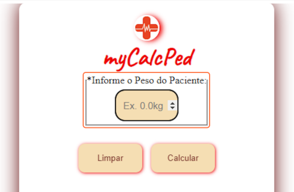
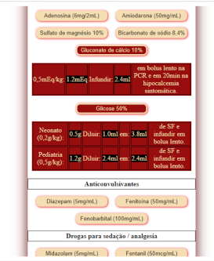
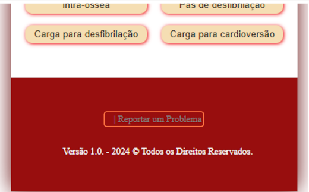
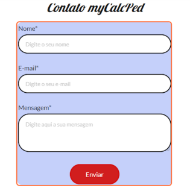

# myCalcPed
É uma solução de desenvolvimento de ferramenta de cálculo de diluições medicamentosas tendo como referência o peso do paciente.

Com o objetivo de auxiliar potencialmente médicos pediatras nas urgências e emergências hospitalares de todo o mundo. Apresentamos essa ferramenta de cálculo de diluíções de medicações tendo como referência apenas o peso informado de um paciente. A aplicação conta com uma variedade de medicações pré definidas a um toque, acesse: [mycalcped.com](https://mycalcped.com/) e conheça a sua facilidade voltada a eficiência no atendimento pediátrico/adulto hospitalar.

##### Tela Inicial

##### Botões Interativos

##### Formulário de Contatos

### Teste
Projeto atualmente em validação por profissionais da área

### Desenvolvido por
Adalto C R S Junior - Março 2024. Versão: 1.0.
